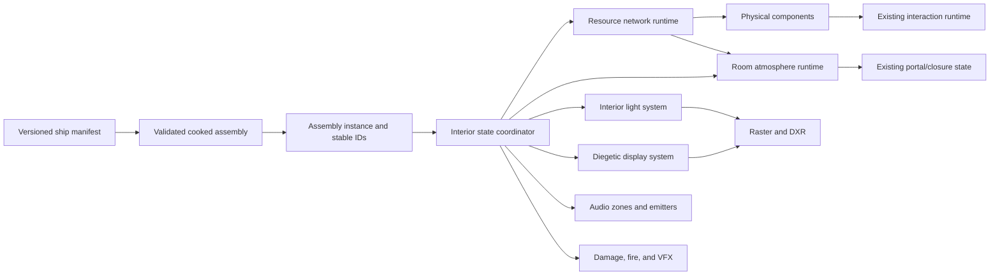

# High-Fidelity Ship Interiors and Cockpits

Date: 2026-07-22

Status: production design and engineering direction

Applies to: every boardable ship, station vehicle, cockpit, bridge, and occupied
technical compartment in The Dawning

## Decision

The Frontier Courier Mk1 cockpit completed by WS-032 is an accepted testing
baseline. It proves generated-source ingestion, dimensional normalization,
sealed modular dressing, deterministic cooking, collision-safe traversal, seat
possession, ship-root composition, and raster/DXR execution. It is not the final
visual target for production cockpits.

Future interiors will pursue the density, credibility, responsiveness, and
systems integration associated with modern high-fidelity space simulations.
This means functional industrial design first, not indiscriminate surface noise.
Every visible feature must communicate structure, operation, maintenance,
safety, manufacture, history, or state.

The Dawning will develop its own manufacturers, layouts, silhouettes, symbols,
materials, and fiction. This document studies production principles visible in
Star Citizen and real crewed-vehicle guidance; it does not authorize copying a
specific ship, room, control panel, texture, logo, or manufacturer language.

## Executive Finding

A convincing cockpit is the visible end of a connected simulation. The art only
holds up when the following layers agree:

1. The ship role, crew, mission duration, and manufacturer determine the layout.
2. Human scale, sightlines, reach, ingress, egress, and maintenance determine the
   hard points before detailed art begins.
3. The ship is decomposed into reusable structural and systems modules around a
   protected gameplay whitebox.
4. Materials, lighting, displays, sound, motion, and effects are driven by one
   authoritative ship state rather than authored as unrelated decoration.
5. Rooms, portals, components, resource paths, damage, and repair are physical
   and inspectable.
6. Visual detail is hierarchical: large structural masses establish form,
   medium-scale assemblies explain function, and fine detail rewards close
   inspection.
7. Production acceptance includes traversal, interaction, atmosphere, failure
   states, audio, renderer parity, LODs, performance, and save restoration.

The immediate engineering implication is clear: the next fidelity gain should
not be another monolithic generated room. The next bounded engine slice should
add state-driven local interior lighting and an interior state coordinator,
then place diegetic displays and physical ship systems on that foundation.

## Research Basis

### Functional ship pipeline

Cloud Imperium's published ship pipeline starts with role and manufacturer,
brings technical design and animation into the first 3D concept, and validates
landing gear, thrusters, cockpit placement, control distance, engineering,
quarters, and weapons before final art. Its whitebox and "slice and dice" stage
defines the functional pieces and hierarchy so art, implementation, animation,
damage, and LOD work can proceed against the same structure. The later passes
add wear layers, lighting, audio, damage helpers, effects, and diegetic UI.

Source:
https://robertsspaceindustries.com/en/comm-link/transmission/14244-How-Ideas-Take-Flight-The-Star-Citizen-Ship-Pipeline

The useful lesson is not a particular aesthetic. It is the order of operations:
function and hierarchy are design authority; art is built around them.

### Current gold-standard scope

The Alpha 4.8 Hammerhead gold-standard notes treat interior quality as a joint
art-and-systems gate. The listed work includes collision, breathable turret
cockpits, visareas, atmosphere, life-support load, physical component bays,
relay interactions, screen alignment, hit targets, elevator clipping, audio
transitions, storage, and animation behavior.

Source:
https://robertsspaceindustries.com/en/comm-link/Patch-Notes/21168-Star-Citizen-Alpha-48

For The Dawning, "production interior" therefore means a complete operational
environment. A beautiful static mesh with no room, state, interaction, or
failure model remains source art, not an accepted ship interior.

### Physicalized engineering

The current engineering guide distinguishes ships by how much of their
component and relay network can be physically reached. Its highest readiness
stage exposes all physicalized components and relays and supports repair through
physical access, engineering screens, or MFDs.

Source:
https://robertsspaceindustries.com/en/comm-link/transmission/20935-Engineering-Gameplay-Guide

Alpha 4.5's release notes describe finite power budgets, distribution among ship
systems, relays and fuses, physically replaceable components, component-health
performance thresholds, room atmosphere, fire propagation, venting, smoke
filtering, and visual/audio warnings.

Source:
https://robertsspaceindustries.com/en/comm-link/Patch-Notes/20934-Star-Citizen-Alpha-450

The transferable principle is that service panels need real consumers and real
failure consequences. Decorative breaker boxes alone do not create engineering
gameplay.

### Reusable kits and hero rooms

Recent production reports describe using an expanding asset library to bring
older layouts to current metrics, concentrating bespoke effort on hero rooms and
core traversal, and adjusting cockpit geometry for visibility and control input.

Sources:

- https://robertsspaceindustries.com/en/comm-link/transmission/21094-Star-Citizen-Monthly-Report-March-2026
- https://robertsspaceindustries.com/en/comm-link/transmission/21043-Star-Citizen-Monthly-Report-February-2026
- https://robertsspaceindustries.com/en/comm-link/transmission/19317-Star-Citizen-Monthly-Report-May-2023

The Dawning should use a manufacturer kit for repeated frames, panels, doors,
vents, fasteners, lights, displays, and service modules, then reserve bespoke
geometry for the cockpit, engineering, command, medical, and other role-defining
spaces. Reuse provides consistency and leaves time for meaningful hero detail.

### Materials and readable wear

Published art reports describe layered hard-surface materials, shared wear and
dirt behavior, POMs, decals, labels, dashboard textures, damage maps, and
manufacturer-specific material passes. They also call out preventing cockpit
glass wear from obscuring the pilot's view.

Sources:

- https://robertsspaceindustries.com/comm-link/transmission/16551-Monthly-Studio-Report-April-2018
- https://robertsspaceindustries.com/en/comm-link/transmission/19317-Star-Citizen-Monthly-Report-May-2023
- https://robertsspaceindustries.com/en/comm-link/transmission/19082-Star-Citizen-Monthly-Report-November-December-2022

Wear must follow contact, heat, maintenance access, airflow, leakage, UV
exposure, and repair history. Random grunge across every surface destroys scale
and makes the room less believable.

### Lighting, displays, and feedback

Published cockpit work pairs rebuilt dashboards and displays with interaction
and lighting revisions. Other ship work uses explicit normal, auxiliary, and
emergency light groups with transitions. Building Blocks and earlier projected
UI systems support in-world displays with ship-specific visual languages.

Sources:

- https://robertsspaceindustries.com/en/comm-link/transmission/16158-Monthly-Studio-Report-September-2017
- https://robertsspaceindustries.com/comm-link/transmission/14390-Updated-Arena-Commander-10-Released
- https://robertsspaceindustries.com/en/comm-link/transmission/18177-Welcome-To-Orison-Alpha-314

The Dawning must drive luminaires, display content, indicators, audio, and VFX
from shared state. An emergency cannot be a red texture swap while the screens,
room audio, and component behavior continue to report normal operation.

### Human factors

NASA's current human-system standard treats architecture as the volume and
arrangement needed for all crew tasks and requires lighting appropriate to the
task rather than one universal illumination level. NASA's Human Integration
Design Handbook supplies the design rationale and methods for crewed-spacecraft
anthropometry and workspaces. FAA flight-deck guidance treats display hardware,
information presentation, alerts, controls, arrangement, and automation as one
evaluation problem.

Sources:

- https://standards.nasa.gov/standard/NASA/NASA-STD-3001_VOL_2
- https://www.nasa.gov/organizations/ochmo/human-integration-design-handbook/
- https://www.faa.gov/documentLibrary/media/Advisory_Circular/AC_00-74.pdf
- https://www.faa.gov/regulations_policies/advisory_circulars/index.cfm/go/document.information/documentid/1019692

The Dawning is entertainment software, not a certified spacecraft. These are
design references, not claims of certification. They support testing across the
game's character sizes, gear envelopes, camera positions, input devices, and
critical interaction sequences instead of tuning a cockpit for one screenshot.

### Transfer format and render capability

The glTF 2.0 core format already carries metallic-roughness PBR, normal,
occlusion, and emissive inputs. Standard extensions cover punctual lights,
clearcoat, transmission, emissive strength, material variants, texture
transforms, and GPU instancing. Blender 4.5 can export these features, but engine
support must be explicit and validated; presence in a GLB does not make a
feature usable at runtime.

Sources:

- https://registry.khronos.org/glTF/specs/2.0/glTF-2.0.html
- https://docs.blender.org/manual/en/4.5/addons/import_export/scene_gltf2.html
- https://github.com/microsoft/DirectX-Graphics-Samples

## The Dawning Interior Language

### Identity before detail

Every manufacturer or culture receives an authored design-language sheet before
its first production room. At minimum it defines:

- structural rhythm and preferred frame spacing;
- cross-section language: rectilinear, faceted, ribbed, tubular, or blended;
- primary construction materials and exposed joint types;
- panel seam, fastener, latch, handle, and service-door families;
- control shape, interaction color, display typography, and alert language;
- light-fixture family and normal/emergency color behavior;
- safety markings, labels, unit conventions, and icon grammar;
- wear, repair, contamination, and aging behavior;
- luxury, military, industrial, civilian, or improvised finish standards;
- sound signature and expected vibration behavior.

The Frontier Courier family begins as practical frontier utility design:
layered pressure structure, compact service access, visible replaceable modules,
restrained color, durable dark composites and alloys, localized safety color,
and an obvious path from pilot station to exit. It must not become a generic
collection of unrelated science-fiction panels.

### Three-scale composition

Every room is reviewed at three scales:

1. Macro, 2-8 m: pressure shell, frames, floor, ceiling, canopy, doors, major
   equipment, and clear path through the room.
2. Meso, 0.15-2 m: consoles, ducts, seat assemblies, access panels, rails,
   lockers, equipment bays, luminaires, and structural joints.
3. Micro, below 0.15 m: fasteners, labels, edge wear, cable retention, vents,
   switches, seals, stitching, and tool contact.

Micro detail cannot compensate for an incoherent macro silhouette. Meso detail
must explain how the room works rather than cover empty space indiscriminately.

### Geometry rules

- Protect the gameplay whitebox and pressure envelope throughout production.
- Preserve all authored sockets, portals, pivots, interaction anchors, collision
  clearances, walk surfaces, and camera volumes by stable ID.
- Avoid long perfectly flat walls. Break them with structural depth, service
  channels, integrated storage, and believable joints, while keeping the
  navigable envelope clear.
- Bevel every player-visible hard edge at a physically plausible radius.
- Give pressure walls, canopies, doors, and panels believable thickness.
- Provide a reason and access path for every major pipe, cable, relay, filter,
  tank, and component.
- Put fragile controls out of accidental transit paths.
- Make handles, footholds, restraints, and maintenance clearances fit the
  character and suit envelopes.
- Separate every gameplay-moving rigid part and author its closed pose, pivot,
  axis, travel, sweep volume, collision, and state sequence.
- Make the exterior and interior agree at windows, ramps, hatches, landing gear,
  docking collars, turrets, and hull thickness.

### Material rules

- Use real-world reference values and a metallic-roughness workflow.
- Keep base color free of baked lighting and broad fake highlights.
- Use geometry or normal detail for construction; use decals for labels,
  warnings, repair marks, serials, and localized damage.
- Use layered masks for edge handling, foot traffic, hand contact, dust traps,
  heat discoloration, leaks, and maintenance history.
- Reserve glossy response for surfaces that can plausibly stay smooth.
- Keep cockpit glass contamination outside the primary sight corridor.
- Give displays a dark inactive response; black screens must still read as
  physical glass, not holes.
- Treat emissive maps as visible radiance masks. Emissive geometry does not
  replace local light sources.

## Cockpit Standard

### Cockpit design brief

Before whitebox, record:

- ship role, expected flight regimes, crew count, and mission duration;
- seated and suited character envelopes;
- primary ingress/egress and emergency egress route;
- pilot eye point, head-motion volume, and camera collision volume;
- forward, lateral, overhead, and landing sightline targets;
- physical-control reach zones and control handedness;
- primary, secondary, and maintenance display responsibilities;
- required physical components and access panels;
- normal, low-power, emergency, combat, damaged, and depressurized states;
- co-pilot or crew communication and shared-control rules;
- motion, vibration, audio, and restraint behavior.

### Pilot station hierarchy

The station has three information bands:

1. Flight-critical: velocity vector, attitude, flight mode, target/obstacle
   cues, propulsion authority, and immediate alerts remain closest to the view
   axis and require no page navigation.
2. Tactical/navigation: sensors, route, weapons, shields, power allocation, and
   communication occupy configurable primary displays.
3. Systems/maintenance: component health, relay paths, atmosphere, temperature,
   fuel, damage, and repair detail occupy secondary pages and physical service
   locations.

Critical actions require visible acknowledgement. Destructive or safety-critical
actions require deliberate confirmation or a guarded physical control. Input
focus must never silently steal ship control.

### Sightline and camera rules

- Author one canonical seated eye transform and a bounded head-look volume.
- Validate the full player FOV range from the real in-game camera, not only a
  Blender camera.
- Keep the primary view and flight-critical symbology clear of the control stick,
  pilot hands, canopy frames, decorative lights, and screen glare.
- Test landing, docking, formation, combat, and close-structure sightlines.
- Limit head motion before the camera intersects the seat, canopy, dashboard,
  restraints, or character body.
- Make camera vibration state-driven and frequency-banded. It must communicate
  thrust, contact, damage, or turbulence without degrading control readability.
- Apply motion blur after camera and cockpit transforms are coherent. A cockpit
  or central object must never blur because a local decorative animation is
  mistaken for vehicle motion.

### Interaction rules

- Ship-control input, head look, pointer interaction, and UI navigation are
  separate contexts with explicit transitions.
- Mouse look preserves the modern flight-control contract documented in
  `MODERN_SPACE_SIM_CONTROLS_2026-07-21.md`.
- Every usable control has a stable ID, authored interaction volume, approach
  direction, prompt anchor, state, feedback event, and save representation.
- Touch targets are validated at the actual screen geometry and camera distance.
- Physical switches remain synchronized with MFD commands and simulation state.
- Seat enter/exit, power loss, death, disconnect, save/load, and ship streaming
  must release input ownership deterministically.

### Cockpit state matrix

Every production cockpit must demonstrate these states:

| State | Lighting | Displays | Controls | Audio/VFX |
| --- | --- | --- | --- | --- |
| Unpowered | passive daylight/emergency markers only | dark physical glass | mechanical emergency controls only | settling structure, no powered hum |
| Startup | staged fixture activation | boot and self-test | locked until authority is established | relays, fans, confirmation tones |
| Normal flight | balanced ambient and task light | full flight hierarchy | primary flight context | propulsion/load layers |
| Low power | reduced groups and duty cycle | essential pages only | nonessential systems inhibited | unstable or reduced machinery bed |
| Combat | glare-controlled task light | threat-priority layout | combat context | restrained alerts and impact direction |
| Emergency | directional evacuation and fault light | persistent fault and route | guarded recovery actions | spatial alarm, fault-specific layers |
| Depressurized | helmet-compatible low glare | atmosphere warning | sealed-door logic | filtered suit/transmitted sound |
| Damaged | failed/flickering fixtures by circuit | degraded or unavailable surfaces | component-dependent | sparks, smoke, vibration, failure loops |

## Room and Ship Systems Standard

### Rooms and portals

The current assembly contract already defines zones, pressure classes, portals,
closures, and reachability. Production simulation extends these identities; it
must not replace them with a second room graph.

Each room needs:

- stable ID and owning module;
- closed volume in cubic meters;
- initial gas composition, pressure, and temperature;
- life-support demand and heat load;
- gravity and acoustic-zone identity;
- local light groups and emergency route fixtures;
- fire, smoke, contamination, and decompression state;
- portal conductance derived from closure state and seal health;
- occupants, loose props, and physicalized components;
- streaming and visibility-cell membership.

### Resource networks

Ship systems use typed deterministic graphs, not hard-coded room scripts.
Initial resource types are electrical power, coolant, breathable gas, data, and
fuel. A network contains producers, stores, consumers, converters, relays,
breakers, ports, and directed or bidirectional links.

The network solver must:

- run on the fixed simulation step;
- use stable authored IDs and deterministic ordering;
- distinguish requested, allocated, delivered, and consumed quantities;
- enforce capacity, priority, switch, fuse, health, and thermal constraints;
- report fault causes, not merely an on/off result;
- expose read-only snapshots to UI, audio, VFX, and save systems;
- support graph partition and reconnection when modules dock, detach, or stream;
- contain invalid values and reject malformed graphs during cook.

### Components and repair

Every physical component has a functional type, resource ports, health,
operating range, heat generation, failure curve, access volume, mount socket,
removal path, replacement compatibility, and repair behavior. The visible panel
and the simulated component share one identity.

Maintenance access is part of room design. A component that cannot be reached,
removed, inspected, or replaced in the authored space fails design review even
if its panel looks convincing.

## Current Engine Audit

### Foundations already present

| Capability | Current authority | Assessment |
| --- | --- | --- |
| Double-precision moving ship root | `ecs::Transform`, assembly presentation | usable foundation |
| Modular visual/collision assembly | `src/asset/cooked_assembly.*` | usable foundation |
| Stable sockets and zones | `AssemblySocket`, `AssemblyZone` | extend, do not replace |
| Portals and sealable closures | `AssemblyPortal` | topology exists; atmosphere does not |
| Interactions and moving parts | `AssemblyInteraction`, `AssemblyMovingPart` | usable foundation |
| Reversible interior state | `src/scene/assembly_interior_runtime.*` | usable foundation |
| On-foot and pilot possession | gameplay runtime and WS-031/032 tests | accepted vertical slice |
| PBR base/normal/ORM/emissive | `ecs::Material`, raster and DXR records | partial production material stack |
| Directional light and cascaded shadow | `src/render/renderer.*` | exterior foundation only |
| Meshy provenance and deterministic cook | WS-032 tools and manifests | accepted source pipeline |

### Missing production systems

1. Room-atmosphere runtime. `src/sim/atmosphere.*` models planetary flight
   atmosphere and is not a ship-room gas system.
2. Typed ship resource networks and physically accessible components.
3. Punctual/area interior lights, light culling, local shadows, and state groups.
4. Diegetic display surfaces and render-to-texture UI applications.
5. Layered material masks, decals, clearcoat/transmission support, and damage
   overlays beyond the current base PBR inputs.
6. Ship audio emitters, room zones, obstruction/portal propagation, buses, and
   state parameters.
7. Fire, smoke, sparks, leaks, localized damage helpers, and repair effects.
8. Runtime interior visibility cells, portal culling, and module streaming.
9. Production navmesh data and dynamic links for AI traversal.
10. Physical prop storage, restraint, inventory, and component replacement.

## Required Data Contract

The existing assembly schema should move to a versioned additive revision. New
records reference current module, zone, portal, interaction, moving-part, socket,
and provenance indices. They do not duplicate transforms or topology.

### Authoring records

```text
AssemblyRoomEnvironment
  zone_index
  volume_m3
  initial_pressure_pa
  initial_temperature_k
  initial_gas_fractions[]
  gravity_mode
  acoustic_zone_id
  visibility_cell_id

AssemblyResourceNode
  stable_id
  module_index
  component_socket_index
  resource_type
  node_type
  capacity
  priority
  initial_state

AssemblyResourceLink
  stable_id
  from_node_index
  to_node_index
  capacity_per_second
  bidirectional
  relay_interaction_index

AssemblyComponent
  stable_id
  module_index
  interaction_index
  mount_socket_index
  access_volume
  resource_ports[]
  health_model
  thermal_model
  failure_profile
  replacement_class

AssemblyLightFixture
  stable_id
  module_index
  transform
  light_type
  color_temperature_k
  lumens_or_candela
  range_m
  cone_angles
  group_id
  circuit_node_index
  shadow_policy
  emergency_behavior

AssemblyDisplaySurface
  stable_id
  module_index
  transform_or_mesh_surface
  pixel_width
  pixel_height
  application_id
  theme_id
  power_node_index
  interaction_index

AssemblyAudioEmitter / AssemblyAudioZone
  stable_id
  module_or_zone_index
  event_id
  state_parameters[]
  portal_propagation_policy

AssemblyDamageHelper
  stable_id
  module_index
  transform
  effect_class
  affected_component_index
  material_mask_channel
```

All counts, strings, nested items, numeric ranges, indices, cycles, duplicate
IDs, disconnected required consumers, and invalid resource conversions need
hard cooker limits and negative tests before runtime allocation.

## Required Runtime Architecture



### 1. Interior state coordinator

Add `src/ship/interior_state.{h,cpp}` as the one fan-out point for immutable
interior snapshots and state-change events. It consumes assembly interaction,
resource, room, damage, and possession state and emits typed changes for
presentation systems.

It must not let audio, UI, lights, or VFX mutate simulation. Those systems read
the same stable snapshot and acknowledge only presentation ownership.

Suggested state inputs:

```cpp
struct ShipInteriorSnapshot {
    uint64_t topologyRevision;
    uint64_t simulationTick;
    std::span<const RoomState> rooms;
    std::span<const ResourceNodeState> resources;
    std::span<const ComponentState> components;
    std::span<const InteractionState> interactions;
    InteriorAlertState alert;
};
```

The actual stored snapshot must own bounded arrays or handles; a transient span
view is only an API sketch. Persistent and network formats remain versioned and
independent from C++ layout.

### 2. Room atmosphere runtime

Add `src/ship/room_atmosphere.{h,cpp}` rather than expanding planetary
`src/sim/atmosphere.*`. Use zone volumes and current portal closure/seal state.
For the first deterministic slice, conserve gas species mass and thermal energy
across a small room graph using bounded substeps. Vacuum is a graph boundary,
not a magic pressure assignment.

Required tests include sealed-room invariance, two-room equalization, vacuum
venting monotonicity, mass conservation, timestep convergence, damaged-seal
conductance, invalid input containment, and snapshot restoration.

### 3. Ship resource network

Add `src/ship/resource_network.{h,cpp}` with immutable topology and mutable
runtime state separated. Cook adjacency lists in stable ID order. The first
slice should support DC power with sources, batteries, consumers, relays,
capacity, priority, health, and load shedding. Coolant, gas, data, and fuel add
typed solver policies after the power graph is proven.

Do not turn the network into ECS entities connected by arbitrary pointers.
Store bounded stable indices in the ship-owned runtime, then project compact
status components or handles into ECS for render/gameplay queries.

### 4. Interior local lighting

The renderer currently exposes one directional light. Emissive materials shade
the visible surface but do not robustly illuminate the room. Production
interiors require authored point, spot, and practical area approximations.

Implement in this order:

1. Add a bounded CPU `InteriorLight` record with physical units, range, cone,
   group, circuit, importance, and shadow policy.
2. Build a camera-relative GPU light buffer using the existing double-before-
   float boundary.
3. Add tiled or clustered light-list construction for raster rather than
   iterating every light per pixel.
4. Add local-light BRDF evaluation using the same material inputs and exposure
   contract as the directional path.
5. Add a small budget of shadowed hero lights and unshadowed practical lights;
   select shadow updates by visibility, importance, motion, and state changes.
6. Add equivalent punctual-light sampling to DXR. Raster/DXR differences are
   measured defects, not separate art targets.
7. Drive intensity and color transitions from light-group state, never by
   editing fixtures individually from gameplay code.

Rectangular luminaires may begin as emissive geometry plus one or more analytic
area approximations. A later path-tracing milestone can importance-sample
emissive triangles, but that is not required to make the first cockpit readable.

### 5. Diegetic display system

Add `src/ui/diegetic_display.{h,cpp}` and a display-surface runtime. Applications
render into an atlas or pooled render targets, then surfaces sample those
textures through existing material records. Update frequency is per display:
flight-critical surfaces can update every rendered frame, while maintenance and
ambient screens update on change or at lower rates.

Separate:

- semantic data model;
- manufacturer theme and layout;
- render target ownership;
- world-surface placement;
- pointer/raycast interaction;
- input focus and command dispatch;
- accessibility scaling and color alternatives.

The UI reads resource and room snapshots and submits commands through validated
gameplay interfaces. It never writes resource-node memory directly.

### 6. Layered materials and decals

Extend the cooked material format in compatible stages:

1. texture transforms and detail-normal/detail-roughness layers;
2. clearcoat for coated metal, composites, and display glass;
3. transmission/IOR for canopy and physical glass;
4. material-variant identity for manufacturer/condition variants;
5. deferred or mesh decals for labels, wear, leaks, soot, impacts, and repairs;
6. runtime damage masks addressed by stable module/component identity.

Every new channel needs importer validation, cooked-format limits, CPU/GPU
layout assertions, raster/DXR parity tests, missing-texture fallbacks, and a
reference material sphere before production assets depend on it.

### 7. Audio zones and state layers

Create an engine-facing audio interface before selecting or tightly coupling a
middleware backend. The interior contract needs positional emitters, room buses,
portal transmission, occlusion, pressure filtering, reverb sends, loop layers,
one-shot events, priorities, and state parameters.

Cockpit audio is assembled from propulsion, maneuvering, structure, airflow,
cooling, electronics, interaction, warning, impact, damage, and suit layers.
Depressurization changes propagation and filtering; it does not merely lower
master volume.

### 8. Damage, fire, and repair presentation

Damage helpers are authored against modules and components. A damage event can
drive material masks, decals, particles, lights, display faults, audio, room gas,
resource health, and collision only through typed events. Effects must be
seedable and replayable where gameplay state depends on them.

Fire begins as a bounded room/component hazard model. It consumes oxygen,
produces heat and smoke, responds to venting and suppression, and exposes a
presentation snapshot. Particle simulation alone is not the fire state.

### 9. Visibility, streaming, and navigation

Use the authored room/portal graph for conservative interior visibility and
streaming cells. Closed opaque portals can reject downstream cells; windows and
openings retain explicit visibility behavior. Never use pressure state as a
visibility test.

Navigation data belongs to each moving assembly root. Dynamic links consume
existing portal passability. Streaming out a room must preserve component,
resource, atmosphere, interaction, inventory, damage, and occupant state.

## Meshy and Blender Production Method

Meshy is a source generator, not the room authority. The accepted WS-032 lesson
is that complete-room prompts produce poor control over openings, dimensions,
continuity, and gameplay topology. Generate bounded reusable families:

- pressure-frame segments;
- wall, deck, ceiling, and corner bays;
- pilot and crew seats;
- consoles and display bezels;
- relay, fuse, filter, pump, and component housings;
- lockers, bunks, galley, medical, cargo, and tool fixtures;
- ducts, pipes, cable trays, vents, handrails, and trim;
- separate moving door, hatch, lever, and restraint parts.

For every request:

1. Freeze the module dimensions and socket envelope first.
2. Dry-run and retain the exact request hash.
3. Review untextured preview geometry before refinement.
4. Reject silhouette, topology, opening, scale, or role failures immediately.
5. Preserve task IDs, credit use, source hashes, prompts, and rejection reasons.
6. Normalize and repair in Blender against authored dimensions.
7. Replace pseudo-text, logos, incoherent materials, and generated lighting.
8. Author pivots, collision, navigation, sockets, light positions, display
   surfaces, component mounts, and interaction volumes separately.
9. Produce bounded LODs and verify topology and deterministic cooking.
10. Promote only reviewed source masters; rejected binaries remain out of LFS.

Hero rooms should be assembled and art-directed in Blender from modular sources.
Meshy may provide high-quality geometry and material candidates, but the final
room composition, continuity, control ergonomics, labeling, systems placement,
and visual hierarchy are authored work.

## Implementation Sequence

### Phase A: freeze the baseline

Deliverables:

- commit the accepted WS-032 cockpit testing fixture;
- retain all accepted and rejected generation provenance;
- preserve existing collision, traversal, portal, possession, and smoke gates;
- add this document as the production target.

Exit: deterministic assets, tests, builds, raster/DXR smokes, and visual captures
remain green.

### Phase B: interior state and local-light vertical slice

Deliverables:

- additive light-group records in the assembly manifest and cooker;
- `InteriorStateCoordinator` with unpowered, startup, normal, low-power, and
  emergency states;
- camera-relative punctual light buffer;
- raster tiled/clustered local-light evaluation;
- a bounded local-shadow path;
- DXR punctual-light parity;
- Frontier Courier fixture groups and state transitions.

Exit: one command transitions the whole cockpit coherently; emitted markers and
captures prove fixture count, group state, power gating, local shadow coverage,
and raster/DXR brightness/color agreement.

### Phase C: diegetic flight displays

Deliverables:

- display-surface authoring records;
- render-target pool and UI atlas;
- primary flight, navigation, power, and atmosphere test applications;
- raycast interaction and explicit input-focus transitions;
- manufacturer theme data independent of semantic data.

Exit: the real possessed ship drives real display values; power loss, save/load,
camera motion, resolution changes, and renderer mode switches remain correct.

### Phase D: room atmosphere and power network

Deliverables:

- room environment records and deterministic gas solver;
- DC power graph, relays, fuses, priorities, and load shedding;
- physical component records and access volumes;
- portal seal coupling;
- save-ready snapshots and debug graph views.

Exit: opening a sealed portal equalizes rooms, venting changes pressure, a relay
can depower a real light/display consumer, and all conservation, determinism,
malformed-data, and restoration tests pass.

### Phase E: material, audio, and damage production stack

Deliverables:

- detail layers, clearcoat/transmission, decals, and damage masks;
- audio backend interface, positional emitters, room zones, and portal filtering;
- authored damage helpers, component faults, fire/smoke presentation, and repair;
- normal, emergency, depressurized, and damaged cockpit review scenes.

Exit: every state is readable without debug text, no effect contradicts the
simulation, and raster/DXR/material/audio/interaction regression gates pass.

### Phase F: first production hero cockpit

Deliverables:

- approved manufacturer visual-language sheet;
- role, crew, sightline, reach, ingress, maintenance, and state brief;
- protected whitebox and module kit;
- art-directed Blender assembly using reviewed generated sources;
- complete controls, displays, lights, audio, components, wear, damage, LODs,
  collision, navigation, and accessibility validation.

Exit: the room passes every gate below and replaces the testing cockpit only
after an explicit visual and gameplay acceptance decision.

## Acceptance Gates

### Design and human factors

- The cockpit role, crew, manufacturer, mission duration, and state matrix are
  approved before detailed geometry.
- All supported character/suit envelopes can enter, sit, interact, stand, and
  exit without clipping or blocked controls.
- Primary flight information remains legible across supported FOV, resolution,
  input, head-look, lighting, and failure states.
- Flight, head-look, pointer, and UI input contexts transition explicitly.
- Critical actions acknowledge input and destructive actions are deliberate.

### Geometry and content

- The room preserves the certified 2.1 m standing clearance and 0.95 m minimum
  clear doorway unless a later ship-class contract explicitly supersedes them.
- Exterior/interior openings, hull thickness, windows, and moving parts align.
- LODs, pivots, collision, sockets, interaction volumes, and access paths are
  authored and stable.
- No rejected or unreviewed generated binary is promoted to source authority.
- All source requests, tasks, hashes, credits, cleanup revisions, and decisions
  are retained without credentials.

### Simulation and state

- Resource and atmosphere solvers are deterministic at the fixed step.
- Room gas mass and energy errors remain within documented tolerances.
- Every required consumer has a valid resource path or an intentional offline
  state.
- Portal motion, traversal, seal, visibility, audio, and atmosphere consumers
  agree on the same closure identity.
- Save/load restores interaction, component, resource, room, light, display,
  damage, and possession state atomically.

### Rendering

- Local lights use camera-relative positions and bounded GPU records.
- Practical emitters visibly illuminate nearby geometry; emissive surfaces and
  analytic lights remain visually aligned.
- Shadow selection and update budgets are measurable and deterministic.
- Display targets remain sharp at the intended viewing distance and do not
  shimmer, ghost, or blur after camera movement stops.
- Material and light results remain acceptably matched in raster, stable DXR,
  and full DXR.
- Interior profiling records CPU time, GPU time, visible lights, shadow updates,
  draw/dispatch counts, texture residency, triangles, and render-target memory.

### Audio, VFX, and feedback

- Normal, startup, low-power, emergency, depressurized, and damaged states are
  identifiable with and without UI text.
- Audio changes continuously across portals and pressure states.
- Every moving part, interaction, alert, fault, and major effect has coherent
  visual and audio feedback.
- Alerts are prioritized; simultaneous faults cannot produce an unintelligible
  wall of light and sound.

### Regression evidence

- CPU unit tests and malformed-input negative controls;
- deterministic cooker and source-hash checks;
- Debug and Release builds and CTest;
- raster, stable DXR, full DXR, and GPU-validation smoke;
- exterior, entry, seated, standing, maintenance, low-power, emergency,
  depressurized, and damaged captures;
- interactive flight, exit, traversal, repair, re-entry, and save/load witness;
- reference-ship regression remains intact until intentionally retired.

## Tooling Decision

Do not build a large Unreal-style editor before these schemas stabilize. The
first tooling should be narrow and authoritative:

- manifest validation and topology visualization;
- room/portal/resource graph inspection;
- light and display placement previews;
- collision, clearance, reach, and camera-volume overlays;
- material and decal inspectors;
- deterministic cook and budget reports;
- scripted review-camera capture matrices.

Once two production ships have exercised the same contracts without schema
churn, build an integrated ship-interior editor that edits those manifests. The
editor must not create a second runtime format or hide invalid data that CI would
otherwise reject.

## Immediate Next Goal

After the WS-032 testing-baseline commit, claim a new non-overlapping workstream:

**Interior State and Local Lighting Vertical Slice**

It should own additive assembly light/state schema files, new `src/ship/**`
presentation coordination, bounded renderer local-light work, focused tests,
and Frontier Courier fixture data. It must explicitly exclude Claude-owned
`src/sim/**`, orbital work, and unrelated content.

This is the highest-leverage next step because realistic geometry cannot read as
a real cockpit under one exterior directional light, and every later system
needs the same state fan-out to coordinate lights, displays, audio, and damage.
